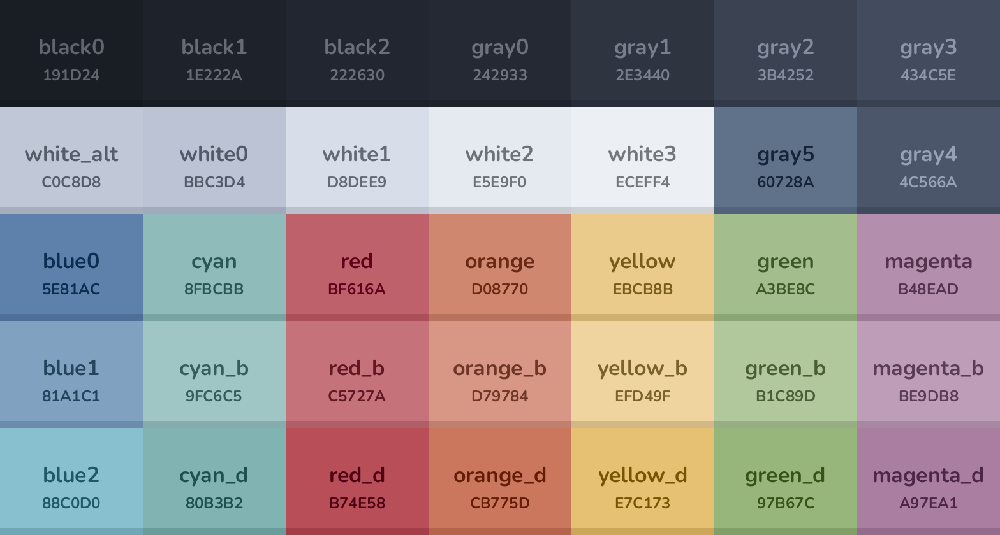

# 🌒 Nordic

[](https://github.com/AlexvZyl/nordic.nvim/actions?workflow=Tests)

A Neovim colorscheme based on [Nord](https://www.nordtheme.com/), but Aurora > Frost. The idea behind this colorscheme is to use Nord, but add some darker colors and use Aurora more prominently than Nord themes usually do. This ends up creating a colorscheme that is soft on the eyes.

If there is anything that does not seem right, even if it is a very small highlight, please let me know with an issue or PR!

# 📷 Showcase


**From my dotfiles:**


# 🎨 Palette

For the list of colors/palette, see [this file](https://github.com/AlexvZyl/nordic.nvim/blob/main/lua/nordic/colors/nordic.lua). Some extra colors and use cases are generated in [this file](https://github.com/AlexvZyl/nordic.nvim/blob/main/lua/nordic/colors/init.lua).



# 📦 Installation

With [packer.nvim](https://github.com/wbthomason/packer.nvim):

```lua
use 'AlexvZyl/nordic.nvim'
```

With [lazy.nvim](https://github.com/folke/lazy.nvim):

```lua
{
    'AlexvZyl/nordic.nvim',
    lazy = false,
    priority = 1000,
    config = function()
        require('nordic').load()
    end
}
```

With [vim-plug](https://github.com/junegunn/vim-plug):

```vim
Plug 'AlexvZyl/nordic.nvim', { 'branch': 'main' }
```

# 🚀 Usage

Using vim:

```vim
colorscheme nordic
```

Using lua:

```lua
vim.cmd.colorscheme('nordic')
-- or
require('nordic').load()
```

Using with lualine:

```lua
require('lualine').setup({
    options = {
        theme = 'nordic'
    }
})
```

If you want to use the color palette somewhere else, you can access it with:

```lua
local palette = require('nordic.colors')
```
> [!WARNING]
> Please make sure that `require('nordic.colors')` is called *after* setup, otherwise the colors might be wrong for your config.

# ⚙️ Configuration

Nordic will use the default values, unless `setup` is called. Below is the default configuration.

```lua
require('nordic').setup({
    -- This callback can be used to override the colors used in the base palette.
    on_palette = function(palette) end,
    -- This callback can be used to override the colors used in the extended palette.
    after_palette = function(palette) end,
    -- This callback can be used to override highlights before they are applied.
    on_highlight = function(highlights, palette) end,
    -- Enable bold keywords.
    bold_keywords = false,
    -- Enable italic comments.
    italic_comments = true,
    -- Enable editor background transparency.
    transparent = {
        -- Enable transparent background.
        bg = false,
        -- Enable transparent background for floating windows.
        float = false,
    },
    -- Enable brighter float border.
    bright_border = false,
    -- Reduce the overall amount of blue in the theme (diverges from base Nord).
    reduced_blue = true,
    -- Swap the dark background with the normal one.
    swap_backgrounds = false,
    -- Cursorline options.  Also includes visual/selection.
    cursorline = {
        -- Bold font in cursorline.
        bold = false,
        -- Bold cursorline number.
        bold_number = true,
        -- Available styles: 'dark', 'light'.
        theme = 'dark',
        -- Blending the cursorline bg with the buffer bg.
        blend = 0.85,
    },
    noice = {
        -- Available styles: `classic`, `flat`.
        style = 'classic',
    },
    telescope = {
        -- Available styles: `classic`, `flat`.
        style = 'flat',
    },
    leap = {
        -- Dims the backdrop when using leap.
        dim_backdrop = false,
    },
    ts_context = {
        -- Enables dark background for treesitter-context window
        dark_background = true,
    }
})
```

**Examples:**

<details>
    <summary><b><code>on_palette</code></b></summary>
&nbsp;

An example of overriding colors in the base palette:
```lua
require('nordic').setup({
    on_palette = function(palette)
        palette.black0 = "#BF616A"
        palette.green.base = palette.cyan.base
    end,
})
```

</details>


<details>
    <summary><b><code>after_palette</code></b></summary>
&nbsp;

An example of setting the visual selection color (for more values see [this file](https://github.com/AlexvZyl/nordic.nvim/blob/main/lua/nordic/colors/init.lua)):
```lua
require('nordic').setup({
    after_palette = function(palette)
        local U = require("nordic.utils")
        palette.bg_visual = U.blend(palette.orange.base, palette.bg, 0.15)
    end,
})
```

</details>


<details>
    <summary><b><code>on_highlight</code></b></summary>
&nbsp;

An example of overriding the `TelescopePromptTitle` colors:
```lua
require('nordic').setup({
    on_highlight = function(highlights, palette)
        highlights.TelescopePromptTitle = {
            fg = palette.red.bright,
            bg = palette.green.base,
            italic = true,
            underline = true,
            sp = palette.yellow.dim,
            undercurl = false
        }
    end,
})
```

And an example of disabling all italics:
```lua
require('nordic').setup({
    on_highlight = function(highlights, _palette)
        for _, highlight in pairs(highlights) do
            highlight.italic = false
        end
    end
})
```

</details>


# 🗒️ Supported Plugins and Platforms

For the list of supported plugins, please take a look at [this file](https://github.com/AlexvZyl/nordic.nvim/blob/main/lua/nordic/groups/integrations.lua). For the list of supported platforms, please take a look at [this directory](https://github.com/AlexvZyl/nordic.nvim/tree/main/platforms).

I do not personally use all of the platforms and plugins in the list, so if something is not right, or you have a suggestion, please open a PR!

# 🎙️ Acknowledgements

- [folke/tokyonight](https://github.com/folke/tokyonight.nvim) served as an excellent example and template to create a Neovim theme.
- [Dotfiles](https://github.com/AlexvZyl/.dotfiles) used in the screenshots.
- [Aonodensetsu/prev_gen](https://github.com/Aonodensetsu/prev_gen) was used to create the palette preview.

</br>

<p align="center">
    <a href="https://github.com/AlexvZyl/nordic.nvim/graphs/contributors">
        
    </a>
</p>
